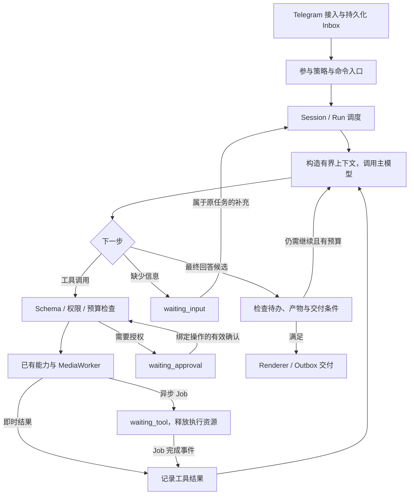

# Mia Bot Agent Loop 重设计草案

日期：2026-09-07；实现状态更新：2026-09-08。下文保留原始设计讨论，不等于所有设计项已实现。

## 当前实现状态（2026-09-08）

- 已实现默认关闭的单进程 runtime、SQLite 输入与任务检查点、原生 Responses 工具往返、工具观察驱动的继续执行、完成条件检查和独立交付记录。
- 已接入 Telegram 私聊／显式群唤醒的自然语言与媒体命令；可追加输入、取消、确认付费操作，异步结果自动唤醒原目标。媒体 worker 保留 legacy 行为，Agent job 只保存产物，交付由 Agent 管理。
- 工具包括上下文读取、看图、生图、改图、贴纸、视频、取消未提交媒体，以及需单独开启的搜索。没有新增 Skill 系统或修改生产模型默认值。
- 已实现每次继续最多 8 个模型步骤、瞬态模型调用最多额外重试 2 次、相同无进展操作限制、目标版本栅栏、本人 Key、审批有效期与模型配置绑定、未知提交不盲目重提。
- 相比下文理想设计，第一版用 Run JSON 保存事件和操作，而非独立 run_items/operations 表；每用户／chat／Topic 一个活动目标，穿插问答仍属于同一活动目标。主模型只接 Responses；搜索使用独立工具包裹现有托管搜索，不做静默协议或模型切换。
- 第一版对超长任务明确暂停，不实现任务内自动压缩；保存并读取现有摘要与记忆，但尚未将 Agent 完成事件接入十轮记忆整理。未实现独立的金额预算或多进程租约调度。
- 第一版产物先按原样交付为文档／视频／贴纸；未重建 legacy 的所有富文本、分享和“再生成”按钮。超 Telegram 大小限制的 Agent 视频目前保留产物并报告交付阻塞，不自动提供下载链接。
- 本地回归使用模拟上游和 Telegram、真实临时 SQLite 与媒体目录；不代表已验证生产渠道兼容性或真实付费生成。开启方法与回退边界见 README。尚未部署。

## 1. 结论与范围

Mia 当前已具备聊天、上下文、媒体任务、视频确认和 Telegram 展示能力，但主链路仍是「单次意图与回复生成 -> 固定业务分支」。本次建议补充统一的、可恢复的单 agent runtime，使工具结果能够驱动下一步，而不是重写所有能力。

产品继续遵循 `bot.md`：自然语言优先的 Telegram 娱乐型助手，重点是个人创作、轻量娱乐和群聊互动，不转向编程助手或办公自动化。

第一版目标：

- 一句话可以组合已有能力，例如「总结刚才的讨论，再做一张相关配图」。
- 工具失败后能依据结构化结果修正参数或解释阻塞，而非只能结束分支。
- 图片、视频等待期间不持续调用模型；任务完成后能继续原任务。
- 用户补充、取消、审批以及进程重启具有明确语义。
- 简单聊天仍可只用一次主模型调用，不强制规划、执行、验证三个模型轮次。

非目标：第一版不引入多 agent、任意 Bash、桌面控制、通用工作流引擎、向量数据库或新的分布式队列。沿用 TypeScript、SQLite、APIMaster、Grammy 和现有服务边界。

## 2. 调研依据与可信度

### Codex：已读本地开源代码

仓库：`/Users/superatom/Documents/openai-codex`，调研时工作区干净。

版本：`ac192cd7937b0d73edc6dffe009940ae53782dd4`，提交时间 2026-09-06。以下结论针对这个快照，不保证未来版本保留相同路径。

| 源码位置 | 实际机制 | 对 Mia 的启发 |
| --- | --- | --- |
| `codex-rs/core/src/session/turn.rs:148` | `run_turn` 接受输入，循环采样；工具调用的输出进入后续采样 | 模型选择下一步，代码负责执行与记录 |
| 同文件 `:334`、`:474` | 在边界吸收 pending input；继续条件包含工具后续需求或新输入 | 新消息不能永远成为与旧任务无关的第二条执行链 |
| 同文件 `:366` | 每步捕获一致的 StepContext，供上下文、工具列表和调用共用 | 一个 step 使用明确的能力与配置快照 |
| 同文件 `:509`、`:551` | 上下文预算触发压缩；没有后续需求时仍检查 stop hooks | 无工具调用不必然代表任务已达成 |
| 同文件 `:2217` | 等待中的工具结果按序写入会话历史 | 工具调用与工具结果必须关联、持久化、可回放 |
| `codex-rs/core/src/tools/parallel.rs:155` | 可并行工具用共享锁，其余用独占锁；支持取消并保留已完成结果 | 并发由工具属性和共享资源决定，不是所有调用一律并行 |
| `codex-rs/core/src/tools/orchestrator.rs:1` | 将审批、沙箱、尝试和重试策略集中管理 | 权限控制独立于模型与业务分支；不照搬本机沙箱细节 |
| `codex-rs/app-server/README.md:77` | Thread / Turn / Item，配合 start、steer、interrupt 和事件通知 | 用户界面与执行内核解耦 |

官方手册也确认 app-server 提供历史、审批与流式 agent 事件。本轮遵循 `openai-docs` 技能读取当前手册，再使用用户指定的本地源码核对执行细节；并非仅依据产品印象做类比。

### Claude Code：官方文档与二手资料分开

已读取用户指定的 `Documents/Hi/Claude Code source code summary.md` 中架构、工具和循环相关内容，以及 `Agent loop 与屏幕理解项目调研.md`。前者是一本源码解析书的截图转录，自述分析 Claude Code v2.1.88，不是本轮独立验证的官方源码。

本轮取得的官方公开依据：

- [How Claude Code works](https://code.claude.com/docs/en/how-claude-code-works)：采集上下文、执行动作、验证结果形成自适应循环；工具结果反馈给下一步；支持中途引导与中断；会话保存消息、工具使用与结果。
- 同页上下文章节：先清理旧工具输出，再按需总结；过度重复压缩会停止并报告问题。
- 同页安全章节：本地文件检查点不能撤销数据库、API、部署等远端副作用。对 Mia 的付费生成尤其重要。
- [官方仓库许可证](https://github.com/anthropics/claude-code/blob/main/LICENSE.md)：当前返回 All rights reserved，使用受商业条款约束。不能把公开仓库或该转录文档等同于可自由复用的完整开源 runtime。

本文不采用二手文档中的内部功能代号、固定工具数量、百分比、缓存成本倍数或完整保留全部用户消息等说法作为已验证工程事实。TAOR 可作为理解模型，不假设它是当前官方代码中的函数名。

## 3. Mia 当前真实结构

基线：`7ee3d1d3ed17271c6b9119f409df2eb871104593`，调研开始时工作区干净。这里是本地源码基线，不代表重新核实了生产部署版本。

```text
Telegram update
  -> 接入鉴权 / 去重 / 消息存储 / 唤醒判断 / 命令与模式处理
  -> IntentRouter.classify（也能直接生成回答，支持上游 web search）
  -> chat / group_summary / vision / image / sticker / video 中的单一分支
  -> 直接回复，或创建 MediaJob
  -> MediaWorker 提交、轮询、交付，保存生成图片上下文
```

关键依据：

- `src/telegram/bot.ts:394` 的 `handleIncoming` 混合参与判断、业务路由、补槽、凭证、上下文、执行与回复；`:795` 之后按意图分支结束请求，`:919` 调用媒体执行器。
- `src/intent/router.ts:83` 的 schema 只输出一个 `intent`，同时包含回复、媒体参数和用户画像更新。它不是只做分类的额外调用，普通聊天可以由这一次调用完成。
- `src/clients/apimaster.ts:184` 的 `StructuredMessage` 只有 system/user/assistant；现有接口没有通用的自定义工具调用与结果往返。`:553` 支持的是上游托管 web search 与 JSON 回复，不能说 Mia 完全没有工具使用。
- `src/media/worker.ts:98` 有恢复逻辑；`:272` 的交付直接依赖 Telegram API。产物能进入后续聊天上下文，但没有通用机制把完成事件交回原任务，继续原先尚未完成的目标。
- `src/follow-up/coordinator.ts:15` 有按群/Topic 合批及串行链；`cancel()` 只取消待合批计时器，不是取消已运行模型请求。私聊和直接唤醒未统一进入该链。
- `src/context/compactor.ts:65` 在十个成功私聊轮次后后台整理摘要和记忆；群聊另有预算与摘要。新 loop 还需要处理单个任务内部大量工具结果导致的上下文增长。
- `src/server.ts:170` 在 `setImmediate` 分发后立即返回 202；`src/telegram/bot.ts:2598` 先认领 update 再执行业务。现有去重不是持久化任务队列，也不能证明崩溃后未处理输入会继续执行。

应保留的资产：媒体 job 状态机和唯一键、每用户三任务限额、十分钟视频确认、提交结果不明确时不自动重提的保护、凭证解析与访客限制、Topic/引用/媒体来源、现有摘要与记忆、结构化 Telegram Renderer、Debug 记录及测试。

## 4. 推荐架构



这是逻辑边界，不要求拆成微服务。主 loop 不应含 `if intent === image_generate` 这样的具体业务分支。

### 4.1 会话、任务和步骤

- Session：沿用 private / group / Topic 的会话边界，增加明确的会话标识与清空版本。
- Run：一个可恢复的用户目标；可跨越多条消息、多个模型步骤及媒体等待。不同于「一次 HTTP 请求」或「一条 Telegram 消息」。
- Step：一次模型调用及其产出的动作请求，记录模型、prompt 版本、工具集合版本和上下文游标。
- Item/Event：输入、模型公开输出、工具请求、结果、审批和交付记录。不是收集模型隐藏思维链。

Run 必须绑定 `ownerUserId`、`chatId`、`threadId`、`replyToMessageId`、`sessionVersion` 和目标版本。共享群聊上下文不等于共享付费授权，也不能让其他群成员随意改写发起人的运行目标。

执行状态建议：`queued / running / waiting_input / waiting_approval / waiting_tool / completed / failed / cancelled / budget_exhausted`。`interrupted` 可作运行事件并带原因，避免再增加一套含义相近的持久状态。

交付单独记录 `pending / sending / delivered / failed / outcome_unknown`。业务已成功但 Telegram 发送失败时，不得重新执行生图等业务动作；面向用户的整体完成需同时满足交付条件。

### 4.2 输入、继续与取消

- 接入在本地事务中持久化输入与唯一 `update_id` 后才返回 accepted；提交失败不能先确认。复用 SQLite，不先引入 Redis。
- 同一会话的模型驱动步骤由一个写入者推进，可使用带到期时间与版本栅栏的数据库 claim；不同会话并发。等待媒体时释放执行资源，保留 Run。
- Run 绑定的回复或审批按钮优先恢复原任务。普通新消息可以是新任务，不把全部群消息直接塞入活动 Run。
- 自然语言「改成横图」作为待确认的任务关联输入处理；在步骤边界吸收，并在外部动作提交前再次检查版本。停止按钮等明确控制事件不依赖模型分类。
- 取消后禁止启动新的工具；尽力中止支持 AbortSignal 的模型或只读请求。已提交的付费任务如果上游不支持取消，必须保留真实状态，不能宣称已撤销或已退款。
- 终态后的补充发起关联的新 Run；等待态的补充恢复原 Run。`/new` 推进会话版本，旧任务事件不得污染新上下文；未完成媒体任务的状态需保留并清楚告知。

### 4.3 模型驱动，但授权由代码决定

新增内部 `ModelStep` 协议，能表达公开回复片段、工具调用、结束原因和 usage。工具参数采用 Zod 校验，调用与结果保留稳定 `callId`；有工具调用时，旁边的文字不能被误判为最终完成。

优先使用 provider 的原生工具调用；APIMaster 适配层负责 Responses 与 Chat Completions 等协议差异，保留必要的 provider continuation 数据。不能把工具结果统一伪装成 user message，也不能只提取输出文本而丢掉工具事件。

本轮没有探测 APIMaster 全部模型的工具兼容性。实现前要通过模拟响应与独立兼容性测试明确 capability：工具调用、并行调用、结构化回复、图片、流式、上下文窗口。仅会输出 JSON 不等于可靠支持工具调用；不兼容的模型保留聊天路径，明确告知能力限制，不暗中替换用户选择。

工具注册项最少包含：名称、输入 schema、结果 schema、所需能力、读写及付费属性、超时、并发资源键、幂等与恢复策略。工具列表根据当前用户权限和任务需要暴露，执行时再次鉴权，凭证不进入模型上下文。

首批能力是现有服务的包装，不是全部新建：

| 能力 | 包装来源 | 关键约束 |
| --- | --- | --- |
| 群聊总结 | `context/group-summary.ts` | 限当前群/Topic 与可见消息 |
| 图片理解 | 现有 vision 客户端与媒体引用 | 验证来源、用户 Key 与模型能力 |
| 生图、改图 | `media/store.ts` + `media/worker.ts` | 付费动作唯一键、现有限额 |
| 贴纸生成 | 现有 sticker 管线 | 保留私聊限定与素材约束 |
| 视频生成 | 现有 draft / claimDraft / worker | 必须有有效的用户确认 |

Web search 已有托管实现，先保留并转换其可观察结果；是否暴露独立搜索工具由真实接口能力决定。普通聊天直接由主模型回答，不必再调用一个「聊天工具」。

权限层继续执行访客只用受限文字凭证、媒体使用本人 Key、群媒体开关、资源作用域和模型可用性。查询结果、群成员发言、网页和工具文本都是数据，不能自行提升授权。

审批凭证绑定用户、Run、工具、规范化参数摘要、有效期和已消费状态。用户修改视频时长、模型或素材后，旧批准不能授权新参数；恢复执行还需重新检查实时权限与额度。

### 4.4 主 loop 的决策规则

1. 获取本次推进的独占 claim，读取 Run，吸收已授权且有关联的输入与工具完成事件。
2. 检查取消、上下文版本、目标版本、运行预算；需要等待时持久化等待态并退出，不占着模型循环。
3. 从历史构建有界投影，按需要压缩；为输出和工具结果预留空间。
4. 调用模型并记录有效输出。模型错误重试有上限；未完成、截断或拒绝的响应不直接视为正常完成。
5. 对工具请求逐个校验和授权，先持久化操作身份，再执行；可并行的只读工具合批，共享资源写入按资源键串行。
6. 即时工具结果记录后回到步骤 1；异步工具保留 outstanding call，记录 Job 关联并进入 waiting_tool，由完成事件补上终态结果后恢复。等待时不制造两个终态 tool result。
7. 模型输出最终答案时，检查是否仍有未完成调用、未满足授权、更新后的输入或明确的产物要求。不满足则在剩余预算内反馈具体差距，不能无条件强迫继续。
8. 回复通过 Renderer 和交付记录发送，成功后确认面向用户的完成。失败、超预算、缺信息都返回真实且明确的状态。

不使用「Think 模型 -> Act 模型 -> Verify 模型」固定三段流水线。验证可由 schema、文件可读性、上游终态和 Telegram 回执完成；只有任务确实需要判断内容是否合意时才增加视觉/语义验证，并计入费用预算。

## 5. 异步恢复、幂等与交付

保留 `MediaJob` 作为慢工具的运行实体，补 `runId / toolCallId / operationId` 关联。现有 `requestKey(message)` 以消息为单位；同一消息产生多个媒体动作时，必须改为能区分独立操作的稳定键，不能让不同动作互相去重。

重试复用同一个 `operationId`，新授权的重新生成才建立新操作。provider 支持幂等键时向上游传递；不支持时，SQLite 唯一键只能防本地重复认领，不能提供跨远端 API 的 exactly-once 保证。

最低持久化设计可由五类记录承担：inbox、runs、run_items、operations、outbox。审批与待完成工具关联可以先存 operations 的类型化字段，Session 复用现有 scope；避免一开始增加十余张高度抽象的表。所有 payload 设大小与保留期限制，媒体存引用，密钥不入库。

| 中断位置 | 恢复策略 |
| --- | --- |
| 输入已入 inbox，尚未创建 Run | 重新认领未完成 inbox，不能被「处理过 update」直接吞掉 |
| 工具准备完成、尚未发送 | 重新检查授权与取消，再执行同一操作 |
| 远端可能已受理、本地没拿到 task ID | 标记 outcome_unknown；可查询则对账，否则停止自动重提并告知用户 |
| 已有媒体 task ID | 继续查询原任务，不创建第二个付费任务 |
| 工具结果已保存、模型还没继续 | 根据未消费的完成事件恢复一次推进 |
| Telegram 已发送但本地未确认 | 交付结果不明，不能假设没发过而无限重发 |

生成成功与发送成功拆开：新 runtime 模式下 worker 负责产物与完成事件，delivery adapter 负责 Telegram；迁移期间 legacy job 仍走旧交付路径，单个 job 只能有一个交付责任方。

优先编辑已知状态消息并记录 message ID，降低重试重复输出。发送新 Telegram 消息与数据库写入不能组成原子事务，outbox 也不能消除所有不确定窗口；需显式保留 outcome_unknown，并由明确策略处理，而不是承诺绝不重复。

## 6. 上下文与成本

上下文分为稳定规则/工具定义、会话与用户可见记忆、Run 目标和约束、必要历史及工具结果引用。频繁变化的时间与状态不放进稳定前缀。保留每个 step 的版本记录，便于复盘当时模型真正看到的内容。

原始消息与工具事件保存在受权限和保留期约束的日志里；每次给模型的是有界投影。压缩不删除未解决目标、最新纠正、待确认参数、operation ID、产物引用和引用关系。审批真值始终来自数据库，摘要不能替代授权。

既保留现有十轮后台记忆整理，也增加 step 前的 token 预算检查。完整历史、长期偏好和当前任务检查点分别管理。大工具结果先截断/提炼并提供可取回引用，不反复把整段数据压缩再塞回。

初始参数建议仅作为回归起点，不是已验证的线上值：

- 普通聊天预计 1 次主模型调用；复杂任务最多 8 次主模型调用，达到上限进入 budget_exhausted 并说明未完成部分。
- 每个只读操作最多 2 次额外瞬态重试；鉴权失败、参数错误和权限拒绝不做同样重试。
- 相同工具与参数连续 3 次没有新增证据时停止自动循环；正常定时轮询交给 worker，不计为主模型进展。
- 模型、工具、压缩和验证调用都纳入 token/费用/活跃执行时长预算，等待审批和媒体另有到期时间。
- 保留每用户最多 3 个活动媒体任务；一次生图授权不自动扩展为无限次「效果不满意就重画」。重生成需要已明确授予的次数/费用额度，否则再次确认。

不存在适用于全部 provider 的统一 token 限额。本地估算需加安全余量，并依据实际 usage 校正；预算数值和模型选择均不在本轮修改生产默认。

## 7. 渐进落地

### 阶段 A：先建立可恢复的执行记录

新增轻量 Run/Inbox/Item/Operation/Outbox 存储和调度，先让旧分支成为单动作 Run，行为保持不变。迁移使用向后兼容的新增表/列，不改写已有媒体状态含义。

验收：进程重启后的待处理输入可继续；同一 update 不重复产生动作；Trace 能区分模型失败、业务失败和发送失败；跨用户/群/Topic 不串任务。

### 阶段 B：单 agent + 原生工具往返

为 `APIMasterClient` 增加工具事件协议适配，将群总结、图片理解和媒体任务包装为工具。私聊与明确唤醒先接入；群聊参与策略保持单独门控，不让每条普通群消息跑完整 agent。

第一个验收场景：「总结刚才的讨论，再生成配图」。要求模型根据总结结果选择后续动作，图片完成后能交付组合结果；不依赖硬编码的两步工作流。第二个场景验证工具参数失败后的修正。

旧 router 暂作兼容路径，不能在每次主模型调用前再重复做一次全量意图/回复生成。命令和翻译模式仍可使用确定性的快捷路径，但共享记录、权限和交付基础设施。

### 阶段 C：中途修改、异步续跑与审批统一

把媒体完成、审批结果、用户关联补充变成可恢复事件。收敛 pending intent 与 video draft 到 Run 等待态，底层媒体数据保持兼容。为每个外部动作增加版本检查与去重测试。

视频从第一天保留现有确认保护，不等阶段 C 才加授权。阶段 C 是把保护纳入统一机制，不是前期绕过保护。

### 阶段 D：体验与灰度

补充节流进度、取消入口、流式展示、上下文预算、无进展检测和 Debug 时间线。是否增加独立子 agent，等真实任务评测证明单 agent 有明确瓶颈后再决定。

以用户/会话灰度开启新 runtime。每个 Run 固定 runtimeVersion；回滚只影响新 Run，运行中的旧版本任务需要排空或保留兼容 worker，不能把半执行状态交给不认识它的实现。

## 8. 验证清单

已有测试可复用：`intent-router.test.ts`、`media-store.test.ts`、`media-worker.test.ts`、`follow-up-coordinator.test.ts`、`conversation-context.test.ts`、`group-media-context.test.ts`、`telegram-presentation-send.test.ts` 等。

新增集成测试采用脚本化模型与工具响应，避免只验证 prompt 文本：

1. 普通聊天一次调用完成，无工具、无额外验证循环。
2. 连续两个工具依赖前一步结果，call/result 对齐；同消息的两个媒体动作互不误去重。
3. 模型同时返回文字和工具调用，不提前交付虚假的完成结果。
4. 参数错误可修正；授权拒绝、账户不可用不被重试或换模型绕过。
5. 访客提示注入无法调用媒体或拿到像素；群用户不能调用他人的 Key、私聊记忆或审批。
6. 用户中途改参数，旧审批失效；旧 step 不能提交新外部动作。
7. 取消前、提交中、提交后分别符合真实可取消能力，不伪造退款或远端撤销。
8. 在 inbox、提交、结果、交付各边界注入崩溃，验证恢复和 outcome_unknown 策略。
9. 等待工具期间不空转模型；完成事件重复送达不重复续跑。
10. 压缩后保留目标、纠正、未完成调用与引用；不让摘要授权外部操作。
11. `/new` 隔离旧上下文；不同群/Topic 不串任务，群中普通消息不劫持活动 Run。
12. 达预算、无进展、模型截断、工具永不完成均能终止或进入明确等待/失败状态。
13. 渠道/模型不支持工具协议时保持兼容聊天并报告限制，不静默换模型或制造工具结果。
14. 生成成功后 Telegram 失败只重试交付，不重新付费生成。

评测同时看任务成功率、错误动作/越权率、重复收费风险、恢复成功率、首个可见反馈延迟、整体耗时、每任务 token 和费用。与旧链路使用相同场景和模型比较；本轮没有实际跑新 runtime 的测试或效果评测。

## 9. 开工前仍需确认的产品选择

- 主循环默认是否使用用户选择的聊天模型；不支持工具时允许保留纯聊天，还是明确提供独立的 agent 模型设置。建议先保留已有选择语义，不静默换模型。
- 自动重新生成图片的付费次数/金额预算。建议初版默认不额外自动重生成。
- 同一私聊等待媒体时，新消息如何关联任务。建议优先引用/按钮关联，明确的新需求建立新 Run，有歧义则澄清。

这些是后续实现的产品选择，不妨碍先完成阶段 A。当前已完成的是调研与草案，不是新的执行引擎。
